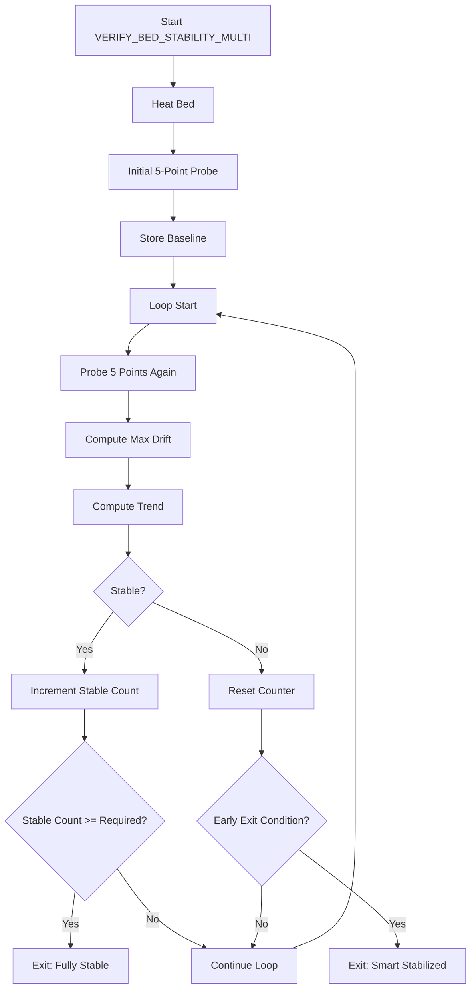

# Eddy NG Multi-Point Thermal Stability Verification for Klipper

A lightweight control system for **Klipper** that uses an Eddy current probe (e.g. Eddy NG) to **verify bed thermal stability and warp convergence** before printing.

Instead of relying on fixed heat soak times, this system:

* Measures **real bed deformation**
* Tracks **multi-point drift over time**
* Detects **true thermal equilibrium**
* Exits early when stabilization is reached

---

## 🚀 Features

* ✅ 5-point bed sampling (center + corners)
* ✅ Drift-based stability detection
* ✅ Smart early-exit (trend-aware)
* ✅ Non-blocking control loop (`delayed_gcode`)
* ✅ Clean integration into `START_PRINT`

---

## 🧠 System Overview

### 🔄 High-Level Flow

```text
Start Macro
    ↓
Initial Probe (5 points)
    ↓
Store baseline
    ↓
Loop:
    ↓
  Probe again
    ↓
  Calculate drift + trend
    ↓
 ┌───────────────┬───────────────┐
 │ Not Stable    │ Stable        │
 │               │               │
 ↓               ↓               ↓
Repeat Loop   Early Exit     Final Exit
```

---

### 📊 Logic Flow



---

### 📍 Probe Layout

```text
  (Xmin,Ymax)      (Xmax,Ymax)

         ●  (Center)

  (Xmin,Ymin)      (Xmax,Ymin)
```

* 5-point sampling detects:

  * Warp
  * Improved Bed Stability Verification
  * Uneven expansion

---

## 📦 Installation

### 1. Download And Add Config File

Download the config file: https://github.com/wildBill83/bed_checker/blob/main/bed_check.cfg

```bash
~/printer_data/config/bed_check.cfg
```

---

### 2. Include in `printer.cfg`

```ini
[include bed_check.cfg]
```

---

### 3. Add Macros

Copy the macro definitions into:

```
bed_check.cfg
```

> ⚠️ The macros are intentionally kept separate from this README to avoid duplication and drift.

---

## ⚙️ Configuration

### Key Parameters

| Parameter   | Default | Description               |
| ----------- | ------- | ------------------------- |
| `BED_TEMP`  | 100     | Target bed temp           |
| `WAIT`      | 30s     | Time between measurements |
| `TOL`       | 0.004   | Stability threshold (mm)  |
| `TREND_TOL` | 0.001   | Trend flatness threshold  |
| `REQUIRED`  | 3       | Stable cycles required    |

---

## ▶️ Usage

Run manually in terminal:

```gcode
VERIFY_BED_STABILITY_MULTI BED_TEMP=100 WAIT=30
```

---

## 🧪 Integration Example (`START_PRINT`)

This is the **recommended usage pattern**:

```ini
[gcode_macro START_PRINT]
gcode:
    
    

    # Start heating (non-blocking)
    M140 S{BED_TEMP}
    M104 S{EXTRUDER_TEMP}

    # Verify bed thermal stability
    VERIFY_BED_STABILITY_MULTI BED_TEMP={BED_TEMP}

    # Generate mesh AFTER stabilization
    BED_MESH_CALIBRATE

    # Final nozzle heat
    M109 S{EXTRUDER_TEMP}

    # Prime / prep
    G92 E0
    G1 Z5 F3000
```

---

## ⚠️ Important Notes

* Requires a properly configured Eddy current probe
* `PROBE` must return consistent `last_z_result`
* Adjust probe margins to avoid clips / edges
* Increase `WAIT` for thicker beds (45–60s recommended)

---

## 🔥 Why This Matters

Traditional workflow:

> “Wait 10 minutes and hope it’s stable”

This system:

> Measures **when the bed actually stops moving**

---

## 🧠 Design Philosophy

This implementation treats your printer as a **feedback system**, not a timer:

* Uses **real measurements**
* Reacts to **physical behavior**
* Stops when **equilibrium is reached**

---

## 🚀 Future Ideas

* 9-point or adaptive grid
* Mesh-to-mesh delta comparison
* Automatic mesh skipping if already stable
* Logging drift over time for diagnostics

---

## 📜 License

MIT (or your preferred license)

---

## 🙌 Credits

Built for advanced Klipper users pushing beyond traditional heat soak workflows.
